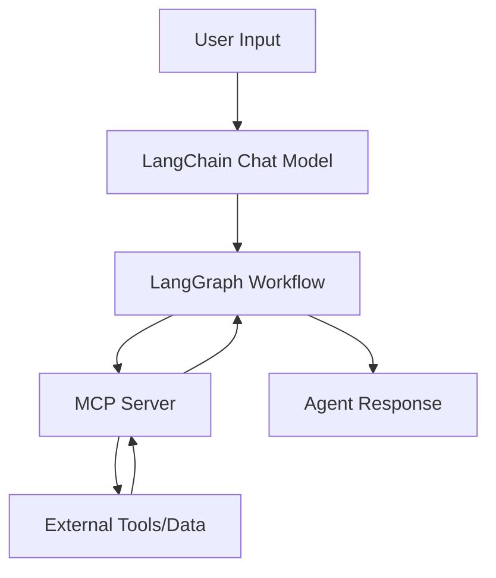

# LangChain + LangGraph + MCP Integration Demo

This project demonstrates how to use **LangChain** and **LangGraph** in Node.js with the **Model Context Protocol (MCP)**.

## Overview

### What is MCP (Model Context Protocol)?
Model Context Protocol (MCP) is an open standard that enables AI applications to securely connect to external data sources and tools. It provides a standardized way for AI models to access real-time information and capabilities beyond their training data.

### LangChain
LangChain is a framework for developing applications powered by large language models (LLMs). It provides:
- **Chat Models**: Interface with various LLM providers
- **Prompts**: Template and manage prompts
- **Chains**: Combine multiple components
- **Memory**: Maintain conversation history
- **Tools**: Extend LLM capabilities

### LangGraph
LangGraph is a library for building stateful, multi-agent applications with LLMs. It provides:
- **State Management**: Maintain conversation and workflow state
- **Graph-based Workflows**: Define complex agent interactions
- **Conditional Logic**: Route between different actions
- **Human-in-the-loop**: Enable human oversight and intervention

## Project Structure

```
src/
├── examples/
│   ├── basic-langchain.ts      # Basic LangChain usage
│   ├── mcp-integration.ts      # MCP with LangChain
│   └── langgraph-workflow.ts   # LangGraph workflows
├── utils/
│   └── config.ts              # Configuration utilities
└── index.ts                   # Main entry point
```

## Installation

1. Install dependencies:
```bash
npm install
```

2. Set up environment variables in `.env`:
```bash
OPENAI_API_KEY=your_openai_api_key_here
MCP_SERVER_URL=http://localhost:3000
```

## Running Examples

### Basic LangChain Example
```bash
npm run basic-example
```

### MCP Integration Example
```bash
npm run mcp-example
```

### LangGraph Workflow Example
```bash
npm run langgraph-example
```

## Key Concepts

### 1. MCP Integration
- Connect to MCP servers
- Load tools from MCP servers
- Use MCP tools in LangChain chains

### 2. LangGraph Workflows
- Define state schemas
- Create nodes and edges
- Implement conditional routing
- Handle tool calling

### 3. Agent Patterns
- ReAct (Reasoning + Acting)
- Tool-calling agents
- Multi-step workflows

## Features Demonstrated

- ✅ Basic LangChain setup and usage
- ✅ MCP server integration
- ✅ LangGraph state management
- ✅ Tool calling with MCP
- ✅ Conditional workflows
- ✅ Error handling
- ✅ TypeScript support

## Architecture



## Common Use Cases

1. **Data Retrieval Agents**: Access databases, APIs, and files
2. **Tool-using Agents**: Execute code, search web, send messages
3. **Multi-step Workflows**: Complex reasoning with multiple tools
4. **Human-in-the-loop**: Approval workflows and oversight

## Dependencies

- `@langchain/core`: Core LangChain functionality
- `@langchain/openai`: OpenAI integration
- `@langchain/langgraph`: LangGraph workflow engine
- `@langchain/mcp-adapters`: MCP protocol adapters
- `@modelcontextprotocol/sdk`: MCP SDK for Node.js

## License

ISC
